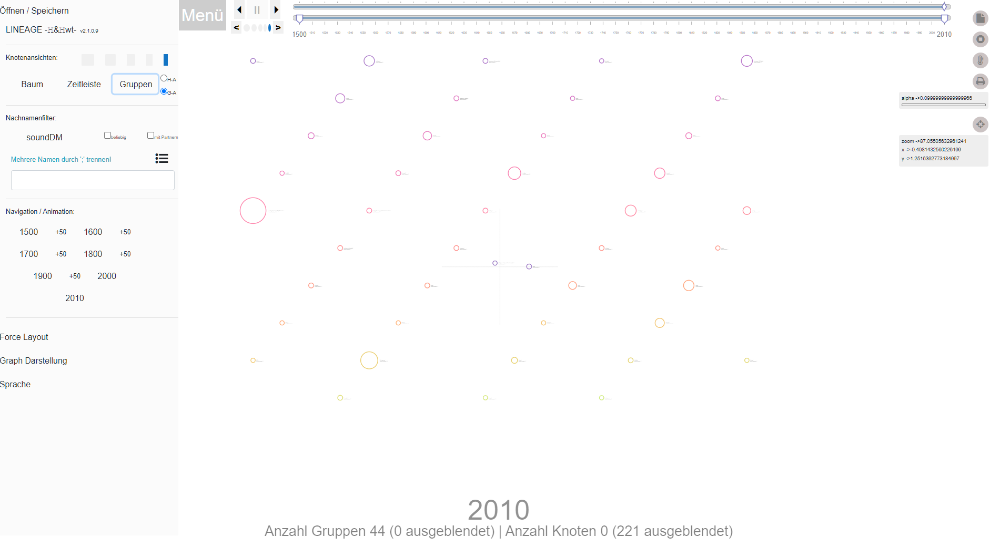

Dieses [webtrees](https://www.webtrees.net/) Modul enthält Lineage, ein Knoten-Link-Diagramm, das genealogische Beziehungen visualisiert. Lineage wurde ursprünglich von [Ben Garvey](https://github.com/bengarvey/lineage) entwickelt, ich habe es seinerzeit in einer angepassten Version auf der Homepage von [Horst Stern](https://knoten.familie-stern.de/) entdeckt.

* Copyright (C) 2022 huhwt - EW.H

Die hier vorgestellte Version kombiniert die Konzepte der Originale mit Elementen aus TAM und eigenen Erweiterungen.

Derzeit ist das Modul noch in laufender Entwicklung, noch nicht alle Aktionen führen zu den gewünschten Ergebnissen.  Die primären Funktionen sind jedoch bereits genügend stabil, so dass ich es für vertretbar halte, es als **Pre-Release** zu veröffentlichen.

Was noch offen ist: 
* Übersetzungen - es gibt kaum Einträge für i18n
* Storage-Management - Lesen und Schreiben von/auf Datei funktioniert, in/aus IndexedDB funktioniert nicht
* Gnitches - Einige Einstellungen wirken in allen Funktionen, andere nur lokal in ihrem Zweig, da muss noch nachgearbeitet werden
* Feintuning und Review - es funktioniert ... aber elegant ist es nicht wirklich. Anregungen und Hinweise werden gerne entgegen genommen ... 

## Contents
Dieses Readme enthält die folgenden Hauptabschnitte

* [Beschreibung](#description)
  * [Allgemeines - Baum Ansicht](#linTREE)
  * [Gruppen Ansicht](#linCLUSTER)
  * [Zeitleiste Ansicht](#linTLINE)
* [Voraussetzungen](#requirements)
* [Installation](#installation)
* [Upgrade](#upgrade)
* [Übersetzungen](#translation)
* [Support Contact](#support)
* [Danksagungen](#thanks)
* [Lizenz](#license)

## Beschreibung

### Einführung

Lineage oder **LIN** ist ein Node-Link Diagramm auf Basis einer D3.js Force Simulation. Die Nodes stehen für Personen, die Links zeigen die Beziehungen (Eltern-Kind(er)/Partnerschaft) auf.
> Die Darstellung läuft nach der Datenübernahme ausschließlich lokal im Browser des Benutzer-Rechners.
Mit dieser technischen Plattform ist die Darstellung hochdynamisch und kann unmittelbar auf verschiedenste Einstellungen reagieren.
>> (Es gibt eine Kehrseite: Bei großen Knotenzahlen - in der Größenordnung von mehreren Tausend Personen - wird es (auch abhängig von der Leistung des lokalen Rechners) einigermaßen dauern, bis sich die Darstellung aufbaut und länger noch, bis sie relative Stabilität erlangt hat. Ein Trostpflaster: im Test wurden auch Knotenzahlen von 10.000+ mit mehr als 30.000 Verknüpfungen langfristig stabil gehandhabt.)

Anders als [TAM](https://github.com/huhwt/huhwt-wttam), wo die Familien ein zentrales Element der Darstellung sind, stellt LIN die Verbindung von Eltern und Kindern jeweils einzeln dar und die Beziehung zwischen den Eltern als eigene optisch abgesetzte Verknüpfung.

Die primäre Darstellung ist die Baum-Ansicht mit den Verknüpfungen. Alternativ können die Personen auch in einer Zeitleiste oder nach Familiennamen gruppiert dargestellt werden.

### Allgemeines - Baum-Ansicht

Die Knoten werden nach Geschlecht differenziert - Frauen als Kreise, Männer als Quadrate. Die Farben variieren mit den Familiennamen.

Die Links zwischen Eltern und Kindern sind gerichtet, zu männlichen Nachkommen hellblau, zu weiblichen pink ... ('Tschuldigung). Die Links zwischen den Eltern sind ungerichtet, unterbrochen und in einer gelb-grünen Farbvariante gehalten.

Die Daten werden aus Webtrees extrahiert, als Schnittstelle dient [huhwt-cce](https://github.com/huhwt/huhwt-cce). Die dort in einer Session-Variablen abgelegten Daten werden vom PHP-Anteil dieses Moduls auf IndexedDB umgeschrieben. Die eigentlichen LIN-Komponenten greifen auf die Informationen in IndexedDB zu und sind als solche unabhängig von der Server-Seite.

Eine grundsätzliche inhaltliche Kopplung an Webtrees gibt es jedoch in Bezug auf das Farbschema der Personen-Knoten. Webtrees bietet neben dem Nachnamen im Klartext auch die Umsetzung gemäß [Soundex](https://en.wikipedia.org/wiki/Soundex) sowohl im Standard als auch in der Daitch–Mokotoff-Variante an. Alle 3 Ausprägungen werden in LIN übernommen. Die SoundDM-Ausprägung dient dabei als Index-Merkmal für den D3js-Farbraum [interpolateSinebow](https://github.com/d3/d3-scale-chromatic/blob/main/README.md#interpolateSinebow). Familiennamen, welche sich z.B. in Groß- und Klein-Schreibung oder alternativen Umlaut-Schreibweisen unterscheiden, werden so gleichfarbig dargestellt, anders als wenn man den Namen im Klartext verwendet. 

In der Gruppendarstellung kann man durch Wechsel des Ordnungskriteriums die Darstellung umschalten; je nach Kriterium ergeben sich unterschiedliche Verteilungen.

#### Einstellungen Menü

Am linken Bildschirm-Rand ist ein umfängliches Menü eingeblendet (Klick auf die 'Menü'-Schaltfläche blendet es aus). Man kann hierüber Lese- und Schreiboperationen anstossen, zwischen den Ansichten umschalten, diverse Optionen der Darstellungen aktivieren/abschalten und verändern und den Bezugs-Zeitpunkt der Darstellung einstellen.

#### Zeitsteuerung
Eine wesentliche Ergänzung des Lineage-Ursprungs besteht in der Möglichkeit, den Bezugs-Zeitpunkt der Darstellung einzustellen. Der Darstellungszeitraum ist auf die Zeitspanne von 1500 bis zum letzten relevanten Personendatum aufgerundet auf glatte 10-er Jahre voreingestellt. Sollte ein Personendatum vor 1500 gefunden werden, erweitert sich die Zeitspanne entsprechend um glatte 100-er Jahre nach vorne. Im Menü werden nun entsprechende Sprungmarken eingefügt, so dass man den Bezugszeitpunkt auf die jeweiligen Jahrhundert-Marken einstellen kann.

Eine feinere Einstellung bis hinunter zu 1-Jahres-Schritten erlaubt ein spezieller Steuerelemente-Komplex:

Im oberen Bereich des Bildschirms befindet sich ein Doppel-Slider und ein Start-Stop-Block.
* Mit dem unteren Slider kann man Anfangs- und Endwert des Darstellungszeitraums in 10-Jahres-Schritten beeinflussen. Der obere Slider erlaubt es, im Darstellungszeitraum frei in 10-Jahres-Schritten zu wechseln.
* Im Start-Stop-Block finden sich Schaltflächen, mit denen man das Bezugsjahr in 1-Jahres-Schritten verändern kann (unten) sowie Elemente, mit denen man automatisch den Darstellungszeitraum nach vorne bzw. hinten durchlaufen (1-Jahres-Schritte) bzw. den automatischen Durchlauf stoppen kann (oben). Die Frequenz des Automatik-Durchlaufs lässt sich schließlich durch 5 weitere Schaltflächen "Jahrläufer - Verweildauer" unten zwischen den 1-Jahres-Schaltern beeinflussen, von recht schnell (ist der Default, 400ms) bis recht langsam (2400ms).

Beim Wechsel des Bezugszeitpunkts werden solche Knoten deren Bezugsjahr außerhalb des Zeitraums liegen automatisch entfernt und auch wieder eingefügt, wenn die Grenzwerte (Startjahr des Darstellungszeitraums - aktueller Bezugszeitpunkt) das Bezugsjahr mit einschliessen.

#### Namen-Steuerung
Eine weitere Ergänzung des Lineage-Ursprungs betrifft die Ausgestaltung der Option, Teilmengen der Nodes nach Familiennamen abzugrenzen. Man kann eine umfassende Liste der Familiennamen aufrufen, wahlweise sortiert nach Häufigkeit oder alphabetisch und innerhalb der Gesamtmenge auch noch abgrenzbar nach Anfangs-Buchstaben. Mittels Checkboxen können nun Namen ausgewählt und als Filter-Kriterium hinterlegt werden. Dabei können auch mehrere Filter-Definitionen gebildet und im weiteren Verlauf zwischen diesen gewechselt werden. Wie beim Bezugsjahr werden alle Nodes, deren Namenskriterium nicht dem aktiven Filter entsprechen, aus der Darstellung entfernt. Das relevante Namenskriterium ergibt sich gemäß der Vorgabe des Names-Schemas (siehe oben), ist z.B. SoundDM gesetzt, werden alle dem SoundDM-Wert eines Namens im Filter entsprechenden Nodes mit angezeigt, auch wenn deren Klarnamen davon abweicht (Man wählt 'Mayer' und erhält 'Meier','Meyer','Meir' usw. dazu).

Durch Klick auf die Checkbox "mit Partnern" werden zusätzlich zu den über den aktiven Filter selektierten Personen auch die jeweils zugeordneten Ehepartner mit in die Darstellung einbezogen. Die repräsentierenden Nodes werden dann mit verringerter Größe dargestellt.

Am unteren Rand des Bildschirms werden der aktuelle Bezugszeitpunkt sowie die Anzahl der aktiven sowie der ausgeblendeten Nodes angezeigt. Bezüglich der ausgeblendeten Knoten wird nicht weiter differenziert, also nicht unterschieden ob der Namens- oder der Zeitraum-Filter gewirkt hat.

#### Allgemeine Steuerflächen
Schließlich gibt es noch Aktions-Schaltflächen oben rechts auf dem Bildschirm:

Mittels der obersten Schaltfläche - ein Drucker-Symbol - lässt sich die aktuelle Darstellung als SVG exportieren.

Die anderen Schaltflächen stehen im Zusammenhang mit der technischen Plattform, welche die Darstellung erzeugt. Wie erwähnt handelt sich um eine D3js-Force-Simulation.
>Die Idee dahinter ist, dass sich eine Darstellung aus dem Wechselspiel von anziehenden und abstoßenden Kräften ergibt, welche iterativ in einer Vielzahl von Durchläufen auf die Nodes wirken. Anfangs ist der Energie-Level der Kräfte hoch und nimmt von Durchlauf zu Durchlauf ab. Die Anzeige wird nicht nach jedem Durchlauf erzeugt sondern nach einem festgelegten Zeitraum. Bei hohem Energie-Level können deshalb die Nodes sprunghaft von einer Bildschirm-Aktualisierung zur nächsten den Standort wechseln, ist der Level niedriger, sind die Standort-Wechsel wesentlich weniger ausgeprägt, so dass man unter Umständen nur noch ein gewisses "Zittern" wahrnimmt. Sobald der Energie-Level unter den Endwert sinkt wird die Iterations-Schleife beendet.

Aus **TAM** wurde das Feature übernommen, dass bei Energie-Level "0" der Darstellungs-Baum mit einer Art Karte unterlegt wird, deren Höhenlinien Jahreswerten entspricht - das **T** in **TAM**. Die zweite Schaltfläche von oben - ein Stop-Symbol - setzt den Energie-Level wechselweise auf "0" - die Karte erscheint - bzw. wieder auf den vorherigen Wert zurück - die Karte verschwindet wieder. (Diese Funktion ist in der Gruppen-Darstellung nicht wirksam)

Jede Simulation beginnt mit einer relativ kompakten Zusammenballung aller Nodes. Jeder Node wirkt auf seine Umgebung. Enthält ein Datenbestand viele Nodes, ist es recht wahrscheinlich, dass bei Ende des Iterations-Zyklus die Verteilung der Nodes durch gegenseitige quasi Blockaden noch nicht wirklich ausgeglichen ist. Ein Iterations-Zyklus beinhaltet ca. 300 Durchläufe, eventuell auch weniger, wenn ein End-Energiewert > "0" vorgegeben ist. Die dritte Schaltfläche - ein Thermometer-Symbol - setzt den aktuellen Energie-Level pro Betätigung um jeweils 0.1 hoch (der Maximalwert ist 1), so dass eine weitere Abfolge von Iterationen angestossen wird. Bei grosser Node-Anzahl wird sich das in weiteren Verschiebungen bemerkbar machen, liegt die Node-Anzahl in eher niedrigem Bereich von maximal einigen 100ern, wird sich die Darstellung eher nicht mehr verändern, da ein stabiler Gleichgewichtszustand der wirkenden Kräften eingetreten sein dürfte.

Unter den Aktions-Schaltflächen wird zur Information der aktuelle "alpha"-Wert angezeigt, er entspricht dem jeweiligen Energie-Level, zur besseren Erkennbarkeit vom Bereich 0-1 auf 0-100 hochskaliert. Ändert sich der Wert nicht mehr, ist der Iterations-Zyklus beendet. Bei der Baum-Darstellung ist aktuell der Endwert 0.05, bei der Zeitleiste 0.01 und bei den Gruppen 0.001 hinterlegt. Das D3js-Verfahren ist nachvollziehbar rechenaufwendig, es stellen sich zwangsläufig Rundungsfehler ein, deshalb werden die angezeigten "alpha"-Werte nicht entsprechend glatt, sondern mit diversen Nachkommastellen angezeigt.

Schließlich ist zu erwähnen, dass die Darstellung Zoom und Pan unterstützt. Mit Klicken in die Darstellung und anschließendem Ziehen kann die ganze Darstellung verschoben werden - PAN. Mit dem Mausrad kann man die Größe der Ansicht verändern - ZOOM. Beim ZOOM wird auch die Position des Mauszeigers berücksichtigt, ein ZOOM-Punkt ausserhalb des Zentrums der Darstellung führt zu einer Verschiebung des ganzen Bildes. Man kann mit einer "Zentrieren"-Schaltfläche die Ausgangssituation wieder herstellen (zur leichteren Orientierung ist der Darstellung insgesamt ein Zielkreuz unterlegt). Skalierung und zeitweiliger Referenzpunkt der Darstellung werden unter der "Zentrieren"-Schaltfläche als Infobox angezeigt.

Die ZOOM-Grenzwerte sind sehr weit gesetzt, so dass man die Darstellung allein darüber steuern kann. Zusätzlich lässt sich aber auch die Größe der Viewbox (das technische Bildschirm-Element in welchem die Darstellung verankert ist) in mehreren Stufen beeinflussen. Im Ausgangzustand ist die Viewbox-Größe auf 6x6 (6000x6000 Pixel) gesetzt, damit lassen sich Bäume mit bis zu 250 Knoten recht übersichtlich abbilden. Ist die Knoten-Zahl höher, ist es wahrscheinlich, dass man die Gesamtsicht erst durch intensives ZOOM erhält. Als Erleichterung kann man die Viewbox um jeweils 2 Stufen vergrößern und verkleinern - ist die Viewbox auf 9x9 bzw. 12x12 gesetzt, werden die Knoten zwar entsprechend kleiner dargestellt, aber die Gesamtsicht ergibt sich auch ohne ZOOM, alternativ lassen sich auch 4x4 und 2x2 einstellen, dann sind die Knoten deutlich größer und auch der begleitende Text in der Darstellung ist gut erkennbar.

> Die Viewbox-Einstellung wirkt unabhängig von der konkreten Ansicht, die ZOOM- und PAN-Einstellung werden jedoch für jede Ansicht unabhängig vorgehalten - bei Wechsel der Ansicht können also die angezeigten (Infobox) von den wirkenden Werten abweichen.

Überstreicht der Mauszeiger einen Node, werden die unterliegenden Informationen als Tooltip angezeigt. Ein Teil davon wird als Begleittext direkt in der Darstellung mit geführt, so der Name in der Baumansicht oder die Ordnungskriterien und Anzahlen in den anderen Sichten.

Beim Klick auf einen Node wird dessen Größe verdoppelt. Zieht man ihn in diesem Zustand an eine andere Position (DRAG-n-DROP), wird er dort fixiert, unterliegt nicht mehr dem Iterations-Verfahren und stabilisiert als Nebeneffekt auch die Positionen der mit ihm über Links verbundenen anderen Nodes. Ein erneuter Klick auf den Node hebt die Fixierung auf, die Größe wird auf den regulären Wert zurückgesetzt und der Node folgt wieder den Simulations-Effekten.

Man kann einen Node auch per Doppelklick fixieren, ohne ihn an eine andere Position zu ziehen; er wird wie beschrieben hervorgehoben und mit einem einfachen Klick wieder freigesetzt.

In der Baum-Ansicht sind Personen und Beziehungen / Knoten und ihre Verknüpfungen / Nodes und Links das zentrale Element, die Darstellung fokussiert auf die individuelle Ebene.

Demgegenüber legen die beiden anderen Ansichten ihren Schwerpunkt auf übergeordnete Aspekte.

### Gruppen-Ansicht

<table><tr>
<td>  </td>
<td>  </td>
</tr></table>
   

Im Zusammenhang mit der Behandlung der Familiennamen - verschiedene Kodierungen per SoundEx - wurde schon erwähnt, dass die Gruppen-Ansicht auf die Namen abhebt. Die Personen werden gemäß der Familiennamen gruppiert, die Namensgruppen sind das primäre Darstellungselement. Es gibt 2 Darstellungs-Varianten, die Ausgangsansicht ist die "Haufen-Ansicht", dabei werden die Namensgruppen als Force-Simulation gezeigt. Die Größe korrespondiert mit der Personenzahl, welche jeweils die gleiche Namens-Kodierung führen. Die Verteilung der Gruppen ergibt sich aus dem Force-Algorithmus. Alternativ lassen sich die Gruppen auch in der "Gitter-Ansicht" zeigen, sie sind dann mit festen Positionen in einem Raster dargestellt, die zugewiesenen Positionen ergeben sich aus dem 1. Buchstabens des Nachnamens - 'A' steht links oben, 'Z' rechts unten. Die Gittergröße korrespondiert in gewisser Weise mit der Anzahl von Gruppen, ist aber grundsätzlich recht großzügig dimennsioniert. Derzeit gehen die unterschiedlichen Gruppen-Radien nicht mit in die Positions-Festlegung ein, überdurchschnittlich große Gruppen können sich deshalb mit umgebenden Gruppen überschneiden - um diesen Effekt zu mindern, werden möglichst große Abstände zwischen den Gruppen angestrebt.

Die Einzel-Personen einer Gruppe werden nach einem RECHTS-Klick eingeblendet. Diese Personen-Knoten unterliegen der Force-Simulation, die Darstellung wird deshalb anfangs turbulent sein. Ein erneuter RECHTS-Klick blendet die Personen-Knoten wieder aus. Ist die Personen-Knoten-Ansicht aktiv, wird der Gruppen-Knoten verriegelt und hervorgehoben.

Die Darstellung der Gruppen-Knoten ändert sich wie beim RECHTS-Klick auch beim DRAG-n-DROP, die Rand-Breite wird verdoppelt und die Farbe wechselt zu einem  kräftigen Lila. In der Baum-Ansicht beendet ein einfacher Maus-Klick den DRAG-n-DROP-Zustand, der Knoten wird dann durch die Force-Simulation mehr oder weniger automatisch auf seine relative Ausgangsposition zurück gebracht. Nicht so in der Gruppen-Gitter-Ansicht, hier bringt erst ein DOPPEL-Klick auf den Gruppen-Knoten diesen wieder auf seinen Gitter-Platz zurück. Die Gruppen-Haufen-Ansicht handhabt das anders, war es ein DRAG-n-DROP-Vorgang, entriegelt der Einfach-Klick den Knoten und er reiht sich wider in die Simulation ein. Ist die Personen-Ansicht aktiv, wechselt zwar erst einmal die Darstellung und der Knoten reagiert wieder auf die Simulation, am Ende des Force-Durchlaufs (spätestens nach einem ReHeat) treten dann aber wieder Verriegelung und Hervorhebung auf. Beendet man die Personen-Ansicht, bleiben Verriegelung und Hervorhebung vorerst noch bestehen und müssen explizit mit Einfach-Klick beendet werden.
 > Grund: Jeder Zustandswechsel wirkt auf die unterliegende Simulation. Herausnahme der Personen-Knoten und gleichzeitiges Entriegeln des Gruppen-Knotens führt zu einer recht chaotischen Entwicklung; die Entkopplung vermindert spürbar die entstehenden Turbulenzen.

Anders als in den beiden anderen Ansichten bewirkt 'Simulation Stop' nur den Abbruch der Force-Simulation, die Zeit-Karte wird nicht aktiviert.

### Zeitleiste-Ansicht

Diese Ansicht fokussiert auf die zeitliche Ebene. Die Personen werden nach Geburtsjahr gruppiert, die Zeit-Gruppen werden über den Zeitstrahl verteilt dargestellt. Die Länge des Zeitstrahls entspricht dabei der Spannbreite der Geburtsjahre. Am unteren Bildschirmrand gibt es ein zusätzliches Steuerelement, mit dem man in der Darstellung navigieren kann. Im Ausgangszustand ist die Darstellung so angeordnet, dass der Mittelpunkt dem Mittelpunkt des Zeitstrahls entspricht. Mit den Schaltflächen des Steuerlements kann man sowohl auf die jeweiligen Extrem-Punkte (1. und letzte Gruppe) als auch auf die Zeitpunkte der jeweils nächstliegenden Gruppen links und rechts (-1 bzw. +1) positionieren bzw. wieder auf das Zentrum zurücksetzen. Die 'Links'- und 'Rechts'-1 Schritt-Schaltflächen sind mit Auto-Repeat ausgestattet, bei längerem Klick auf die Flächen werden die Gruppen fortlaufend gewechselt, hört der Klick auf, endet auch das automatische Weiterspringen.

Beim Sprung auf eine konkrete Gruppe wird auf dem Zeitstrahl die entsprechnde relative Position mit der jeweiligen Jahreszahl markiert, die Gruppe selbst wird hervorgehoben und die gesamte Darstellung wird so verschoben, dass die Gruppe in der Bildschirm-Mitte dargestellt ist.

Eine Zeit-Gruppe wird als vertikaler Balken dargestellt, die horizontale Position entspricht der relativen Position auf dem Zeitstrahl. Die vertikale Ausdehnung korrespondiert mit der Anzahl der Personen in der Gruppe.

Die Personen-Knoten sind in der Ansicht permanent eingeblendet und den Zeit-Gruppen untergeordnet, die horizontale Position ist entsprechend der Zeit-Gruppe, die vertikale Position ergibt sich aus der Reihenfolge beim Aufbau der Gruppen. Per DRAG-n-DROP lässt sich ein Personen-Knoten zwar verschieben, wenn beendet, kehrt er auf die Ausgangsposition zurück.

Die Personen-Knoten sind mit zusätzlichen Eigenschaften ausgestattet: 
* Ein STRG-Klick/CTRL-Klick auf einen Knoten zeigt die ansonsten im Tooltip gelisteten Informationen in einem permanenten Element im Darstellungs-Hintergrund, der Knoten selbst wird an seiner Position hervorgehoben dargestellt. Das Info-Element wird bei einem weiteren STRG-Klick auf den Knoten oder durch einen Einfach-Klick in das Info-Element wieder geschlossen. Werden mehrere Knoten nacheinander solcherart aktiviert, werden die Info-Elemente in der Abfolge ihrer Entstehung von links nach rechts mehrreihig dargestellt. Wird ein Element geschlossen, rücken die nachfolgenden Elemente unmittelbar auf.
* Ein DOPPEL-Klick auf einen Knoten blendet die zugehörigen Beziehungen/Verknüpfungen/Links ein, außerdem wird der Knoten vergrößert und farbig hervorgehoben sowie deutlich oberhalb des Gruppen-Balkens angeordnet. Diese Funktion erlaubt es, Abstammungslinien im Zeitverlauf darzustellen. 

## Voraussetzungen

Dieses Modul benötigt **webtrees** Version 2.1.x.
Dieses Modul hat die gleichen allgemeinen Anforderungen wie für **Webtrees** insgesamt genannt [webtrees#system-requirements](https://github.com/fisharebest/webtrees#system-requirements).

## Installation

In diesem Abschnitt wird beschrieben, wie Sie dieses Modul installieren.

1. Laden Sie die [Neueste Version] (https://github.com/huhwt/huhwt-wtlin/releases/latest) herunter.
2. Entpacken Sie es in das Verzeichnis `webtrees/modules_v4` auf dem Webserver.
3. Benennen Sie den Ordner fallweise in `huhwt-wttam` um. Wenn der Ordner bereits existiert, kann er einfach überschrieben werden. 

## Upgrade

Um die neueste Version zu erhalten, ersetzen Sie einfach die vorhandenen huhwt-wttam-Dateien mit denen der neuesten Version.

## Übersetzungen

Sie können bei der Übersetzung dieses Moduls helfen. Das po/mo-System wird im PHP-Teil verwendet. Die Javascript-Funktionen haben ihre eigene unabhängige i18n-Implementierung.
Aktualisierte Übersetzungen werden mit der nächsten Version des Moduls verteilt.

Bislang gibt spricht das System primär Deutsch, aus **TAM** adaptierte Funktionen sind auch ins Englische und Niederländische übersetzt.

Die Internationalisierung ist derzeit noch `Work in Progress`.

## Support

Issues: Fehler bitte in diesem GitHub-Repository melden.

## Danksagungen

* **Lineage** : Ben Garvey https://github.com/bengarvey/lineage / Jens-Peter Stern https://knoten.familie-stern.de/
* **TAM**     : R.Preiner und Team an der Universität Graz, der das Verfahren in seinem Repository veröffentlicht hat https://github.com/rpreiner/tam.
* **Slider**  : John Walley und Mitgestalter https://github.com/johnwalley/d3-simple-slider
* **i18n**    : Simon Rodwell und Mitgestalter https://github.com/roddeh/i18njs
* **Übersetzung NL** : [TheDutchJewel](https://github.com/TheDutchJewel)
* **D3.js** : [D3js.org](https://d3js.org/) - [D3](https://github.com/d3) auf Github - [Observable](https://observablehq.com/explore) Massen an Beispielen

## Lizenz

Dieses Programm ist quelloffen und unterliegt den Bedingungen der GNU General Public License, entweder der Version 3 der Lizenz oder (nach Ihrer Wahl) einer späteren Version.

Sie sollten eine Kopie der GNU General Public License zusammen mit diesem Programm erhalten haben, falls nicht, siehe <http://www.gnu.org/licenses/>.

* * *