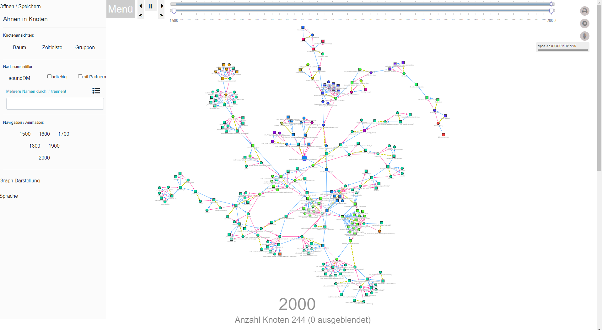
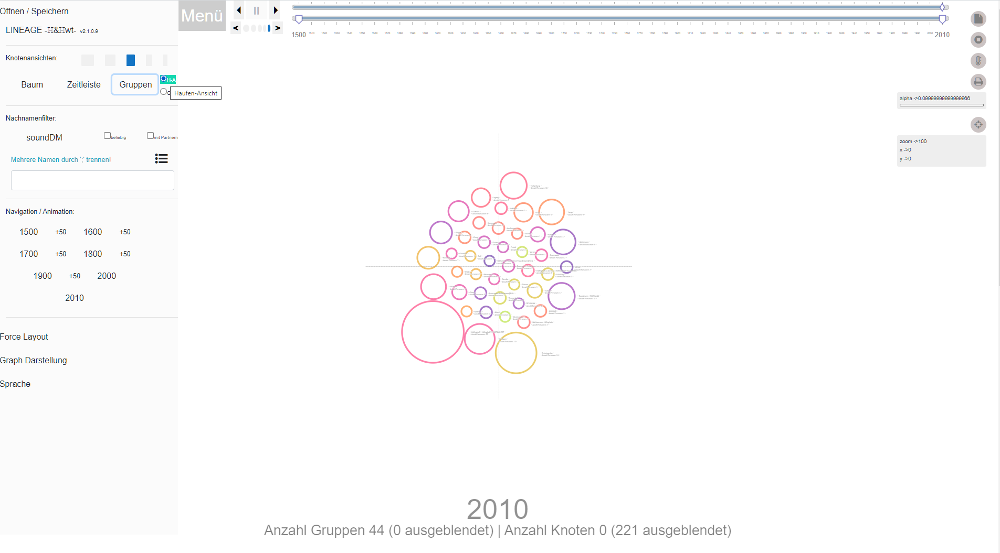
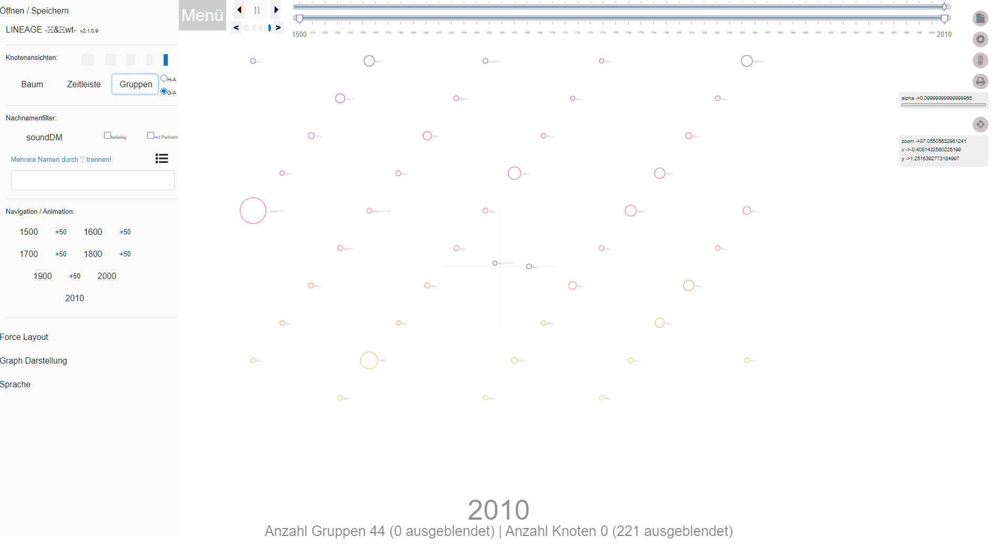
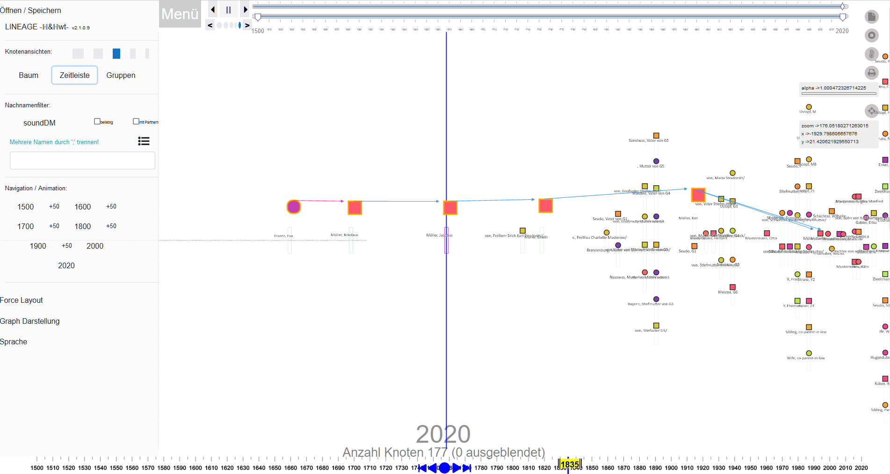

This [webtrees](https://www.webtrees.net/) module hosts Lineage, a node-link diagram that visualizes genealogical relationships. Lineage was originally developed by [Ben Garvey](https://github.com/bengarvey/lineage), I came across it at the time in an adapted version on [Jens-Peter Stern's](https://knoten.familie-stern.de/) homepage.

* Copyright (C) 2022/2023 huhwt - EW.H

The version presented here combines the concepts of the originals with elements from TAM and own extensions.

The module is still under development, not all actions lead to the desired results yet.  However, the primary functions are stable, so I think it is reasonable to publish it as **pre-release**.

What still needs to be done:
* Memory management - read and write to/from file works, to/from IndexedDB does not.
* Gnitches - some settings work in all functions, others only locally in their branch, still need to be reworked.
* Fine tuning and verification - it works ... but it's not really elegant. Suggestions and hints are welcome ...

## Contents
This readme contains the following main sections

* [Description](#description)
  * [General - Tree View](#linTREE)
  * [Cluster View](#linCLUSTER)
  * [Timeline View](#linTLINE)
* [Requirements](#requirements)
* [Installation](#installation)
* [Upgrade](#upgrade)
* [Translations](#translation)
* [Support Contact](#support)
* [Thanks](#thanks)
* [License](#license)

## Description

  ### Introduction

Lineage or **LIN** is a node-link diagram based on a D3.js force simulation. The nodes stand for people, the links show the relationships (parent-child(ren)/partnership).
> After data transfer, the representation runs exclusively locally in the browser of the user's computer.
With this technical platform, the display is highly dynamic and can react immediately to a wide variety of settings.
>> (There is a downside: with large numbers of nodes - on the order of several thousand people - it will take some time (also depending on the performance of the local computer) for the display to build up and even longer for it to achieve relative stability. One consolation: in testing, node counts of 10,000+ with more than 30,000 links were handled stably in the long run).

Unlike [TAM](https://github.com/huhwt/huhwt-wttam), where families are a central element of the representation, LIN represents the linkage of parents and children one at a time, and the relationship between parents as a separate visually distinct linkage.

The primary representation is the Tree View with the links. Alternatively, the individuals can be displayed in a timeline or grouped by family name.

### General - Tree View

The nodes are differentiated by gender - women as circles, men as squares. The colors vary with the family names.

Links between parents and children are directed, to male descendants light blue, to female pink ... ('sorry). Links between parents are undirected, broken and in a yellow-green color variation.

The data is extracted from webtrees, using [huhwt-cce](https://github.com/huhwt/huhwt-cce) as the interface. The data stored there in a session variable is rewritten to IndexedDB by the PHP portion of this module. The actual LIN components access the information in IndexedDB and as such are independent of the server side.

However, there is a basic content coupling to Webtrees with respect to the color scheme of the person nodes. Webtrees offers not only the surname in plain text but also the conversion according to [Soundex](https://en.wikipedia.org/wiki/Soundex) both in the standard and in the Daitch-Mokotoff variant. All 3 expressions are taken over in LIN. The SoundDM expression serves thereby as index characteristic for the D3js color space [interpolateSinebow](https://github.com/d3/d3-scale-chromatic/blob/main/README.md#interpolateSinebow). Family names, which differ e.g. in upper and lower case or alternative umlaut spellings, are represented in such a way in the same color, differently than if one uses the name in the plain text. 

In the group display, the display can be switched by changing the order criterion; depending on the criterion, different distributions result.

#### Actions menu

A comprehensive menu is displayed on the left side of the screen (click on the 'Menu' button to hide it). Here you can start read and write operations, switch between the views, activate/deactivate and change various options of the displays and set the reference time of the display.

##### Read/Write - 'Open/Store'.

The current tree view can be written to and read from an external file as well as from IndexedDB (IDB).
When writing to an external file, the usual file dialog is opened; the file name is given by the record identifier, supplemented by the reference time, and can be customized as desired. When reading from an external file, the file name is used as the record identifier.

The dataset identifier is predefined by wtCCE during the download, it consists of the family tree abbreviation and the identifier of the last CCE action. In the screen view it can be overwritten as desired. The respective content is taken over by the write operations.

When reading, the respective file name(external) or the key expression (IDB) is taken over as data set identifier.

Writing to IDB is executed immediately, there is no explicit feedback.
When reading IDB, an overview of the existing entries is shown, in this overview entries can also be removed to clean up the database.

When writing away, the respective state is documented completely and restored accordingly when reading. So you could prepare a view in the initial view by setting the reference time and dragging and fixing nodes to analyze and document a specific issue, and can then conserve this state by writing away for later resubmission, without having to meticulously repeat all the individual steps later ...

#### Time control

An important addition to the Lineage origin is the possibility to set the reference time of the display. The display period is preset to the time span from 1500 to the last relevant person date rounded up to smooth 10s of years. In the menu now appropriate jump marks are inserted in 50-year intervals, so that one can set the reference time on respective decade marks.

---
> Remark: If a person date before 1500 should be needed, one can/must create hand. The preparation is controlled over 2 parameters - YEARshowMIN -> is converted as earliest permissible person date - YEARrangeMIN -> is converted as starting year of the representation. The values are defined as constants in the header of the JavaSript coding parms.js and would have to be adjusted once according to the requirements.
---

A finer adjustment down to 1-year steps is allowed by a special control complex:

In the upper part of the screen there is a double slider and a start-stop block.
* The lower slider allows to influence the start and end value of the display period in 10-year steps. The upper slider allows to change the display period freely in 10-year steps.
* The start-stop block contains buttons to change the reference year in 1-year steps (bottom) and elements to automatically scroll the display period forward or backward (1-year steps) or to stop the automatic scroll (top). The frequency of the automatic run-through can finally be influenced by 5 further buttons "Year runner - dwell time" below between the 1-year buttons, from quite fast (is the default, 400ms) to quite slow (2400ms).

---
> Note: If you want to adjust the dwell time to your own time requirements, you can also overwrite the values once as described above in the JavaScript coding parms.js - LINloop_Speed.
---

When changing the reference time, such nodes whose reference year is outside the period are automatically removed and also inserted again, if the limits (start year of the display period - current reference time) include the reference year.

#### Name control
Another addition to the Lineage origin concerns the design of the option to delimit subsets of nodes by family names. One can call up a comprehensive list of family names, optionally sorted by frequency or alphabetically, and within the total set also delimitable by initial letter. By means of checkboxes names can be selected and deposited as filter criterion. It is also possible to create several filter definitions and to switch between them in the further course. As with the reference year, all nodes whose name criterion does not correspond to the active filter are removed from the display. The relevant name criterion results according to the default of the name scheme (see above), e.g. if SoundDM is set, all nodes corresponding to the SoundDM value of a name in the filter will be displayed, even if their plain name differs from it (one selects 'Mayer' and gets 'Meier', 'Meyer', 'Meir' etc. in addition).

By clicking on the checkbox "with partners", in addition to the persons selected via the active filter, the respective assigned spouses are also included in the display. The representing nodes are then displayed with reduced size.

At the bottom of the screen, the current reference time and the number of active and hidden nodes are displayed. With regard to the hidden nodes, no further differentiation is made, i.e. no distinction is made as to whether the name filter or the period filter has been applied.

#### General control buttons
Finally, there are action buttons at the top right of the screen:

Using the top button - a printer icon - the current rendering will be exported as SVG.

The other buttons are related to the technical platform that generates the representation. As mentioned, this is a D3js force simulation.
>The idea behind this is that a representation results from the interplay of attractive and repulsive forces, which act iteratively on the nodes in a large number of passes. Initially, the energy level of the forces is high and decreases from run to run. The display is not generated after each run but after a fixed period of time. If the energy level is high, the nodes can change their location abruptly from one screen update to the next. If the level is lower, the location changes are much less pronounced, so that you may only notice a certain "tremor". Once the energy level drops below the final value the iteration loop is terminated.

From **TAM** the feature was taken over that at energy level "0" the display tree is underlaid with a kind of map whose contour lines correspond to annual values - the **T** in **TAM**. The second button from the top - a stop symbol - alternately sets the energy level to "0" - the map appears - or back to the previous value - the map disappears again. (This function is not effective in the group display).

Each simulation starts with a relatively compact agglomeration of all nodes. Each node acts on its environment. If a dataset contains many nodes, it is quite likely that at the end of the iteration cycle the distribution of the nodes is not yet really balanced due to mutual quasi blockades. An iteration cycle contains about 300 runs, possibly less if a final energy value > "0" is given. The third button - a thermometer symbol - raises the current energy level by 0.1 each time it is pressed (the maximum value is 1), so that a further sequence of iterations is triggered. If the number of nodes is large, this will result in further shifts, if the number of nodes is rather low (a few 100s at the most), the display will not change any more, because a stable state of equilibrium of the acting forces has probably been reached.

Under the action buttons the current "alpha" value is displayed for information, it corresponds to the respective energy level, scaled up from the range 0-1 to 0-100 for better recognizability. If the value does not change anymore, the iteration cycle is finished. In the tree display, the end value is currently 0.05, in the timeline 0.01 and in the groups 0.001. The D3js procedure is comprehensibly computationally expensive, rounding errors inevitably occur, therefore the displayed "alpha" values are not shown accordingly smooth, but with various decimal places.

Finally, it should be mentioned that the display supports zoom and pan. By clicking in the plot and then dragging, the whole plot can be moved - PAN. With the mouse wheel you can change the size of the view - ZOOM. ZOOM also takes into account the position of the mouse pointer, a ZOOM point outside the center of the display will cause the whole image to shift. You can restore the initial situation with a "Center" button (for easier orientation, a target cross is underlaid on the display as a whole). Scaling and temporary reference point of the representation are displayed below the "Center" button as an info box.

The ZOOM limits are set very wide, so that the display can be controlled by this alone. In addition, the size of the viewbox (the technical screen element in which the display is anchored) can be influenced in several steps. In the initial state, the viewbox size is set to 6x6 (6000x6000 pixels), so that trees with up to 250 nodes can be displayed quite clearly. If the number of nodes is higher, it is likely that the overall view will only be obtained by intensive ZOOM. To make things easier, the viewbox can be enlarged and reduced by 2 steps - if the viewbox is set to 9x9 or 12x12, the nodes are displayed correspondingly smaller, but the overall view is obtained even without ZOOM. Alternatively, 4x4 and 2x2 can also be set, in which case the nodes are significantly larger and the accompanying text in the display is also easily recognizable.

> The viewbox setting is independent of the actual view, but the ZOOM and PAN settings are maintained independently for each view - so when the view is changed, the displayed (info box) values may differ from the effective values.

If the mouse pointer hovers over a node, the underlying information is displayed as a tooltip. Some of this information is shown as accompanying text directly in the display, such as the name in the Tree View or the order criteria and numbers in the other views.

When clicking on a node, its size is doubled. If you drag it to another position in this state (DRAG-n-DROP), it is fixed there, is no longer subject to the iteration process and, as a side effect, also stabilizes the positions of the other nodes connected to it via links. Clicking on the node again removes the fixation, the size is reset to the regular value and the node follows the simulation effects again.

You can also fix a node by double-clicking on it without dragging it to a different position; it will be highlighted as described and released with a single click.

In the Tree View, people and relationships / nodes and their links / nodes and links are the central element, the display focuses on the individual level.

In contrast, the other two views focus on higher-level aspects.

### Clusters View

<table><tr>
<td>  </td>
<td>  </td>
</tr></table>
   

In connection with the treatment of the family names - various encodings per SoundEx - it was already mentioned that the clusters view focuses on the names. The persons are grouped according to the family names, the name groups are the primary display element. There are 2 display variants, the initial view is the "Heap View", where the name groups are shown as a force simulation. The size corresponds with the number of persons, which lead in each case the same name coding. The distribution of the groups results from the force algorithm. Alternatively, the groups can also be shown in the "Grid View", they are then displayed with fixed positions in a grid, the assigned positions result from the 1st letter of the surname - 'A' is at the top left, 'Z' at the bottom right. The grid size corresponds in some way to the number of groups, but is basically quite generously dimennsioned. At present, the different group radii are not taken into account in the position determination, therefore groups of above-average size can overlap with surrounding groups - to reduce this effect, the largest possible distances between the groups are aimed at.

The single persons of a group are displayed after a RIGHT-click. These person nodes are subject to force simulation, so the display will be turbulent at first. Another RIGHT-click will hide the person nodes again. If the person node view is active, the group node is locked and highlighted.

The display of the group nodes changes as with the RIGHT-click also with the DRAG-n-DROP, the border width is doubled and the color changes to a strong purple. In the Tree View, a single mouse click terminates the DRAG-n-DROP state, the node is then more or less automatically returned to its relative starting position by the force simulation. Not so in the group grid view, here only a DOUBLE-click on the group node brings it back to its grid place. The Group Heap View handles this differently, if it was a DRAG-n-DROP operation, the single click unlocks the node and it rejoins the simulation. If the person view is active, the display changes first and the node reacts to the simulation again, but at the end of the force run (at the latest after a ReHeat) locking and highlighting occur again. If you end the person view, locking and highlighting will remain for the time being and must be explicitly ended with a single click.
 > Reason: Every state change affects the underlying simulation. Removing the person nodes and simultaneously unlocking the group node leads to a rather chaotic development; decoupling noticeably reduces the resulting turbulence.

Unlike in the other two views, 'Simulation Stop' only causes the force simulation to stop, the time map is not activated.

### Timeline View

This view focuses on the temporal aspect. The persons are grouped by year of birth, the time groups are shown distributed over the time bar. The length of the timeline corresponds to the range of birth years. At the bottom of the screen there is an additional control to navigate in the display. In the initial state, the display is arranged so that the center point corresponds to the center of the time beam. The buttons of the control element can be used to position on the respective extreme points (1st and last group) as well as on the time points of the respective closest groups on the left and right (-1 and +1, respectively) or to move back to the center. The 'Left'- and 'Right'-1 step buttons are equipped with auto-repeat, if you click on the areas for a longer time, the groups are changed continuously, if the click stops, the auto-repeat also stops.

When jumping to a particular group, the corresponding relative position on the timeline is marked with the respective year, the group itself is highlighted and the entire display is shifted so that the group is shown in the center of the screen.

A time group is displayed as a vertical bar, the horizontal position corresponds to the relative position on the timeline. The vertical extent corresponds to the number of persons in the group.

The person nodes are permanently displayed in the view and are subordinated to the time groups, the horizontal position corresponds to the time group, the vertical position results from the sequence when building the groups. By DRAG-n-DROP a person node can be moved, but when finished it returns to the starting position.

The person nodes are equipped with additional properties: 
* A CTRL-click/CTRL-click on a node displays the information otherwise listed in the tooltip in a permanent element in the display background, the node itself is highlighted at its position. The info element is closed again by another CTRL-click on the node or by a single click in the info element. If several nodes are activated one after the other in this way, the info elements are displayed in several rows from left to right in the sequence in which they were created. If an element is closed, the following elements move up immediately.
* A DOUBLE-click on a node shows the corresponding relations/connections/links, furthermore the node is enlarged and highlighted in color as well as placed clearly above the group bar. This function allows to display lineages over time. 

The time group bars also have an additional property:
* A CTRL-click on a bar will immediately shift the entire display so that this bar is positioned in the center of the screen (analogous to the stepwise shift via the control buttons) and the associated time marker will be displayed on the timeline.

## Requirements

This module requires **webtrees** version 2.1.x.
This module has the same general requirements as named for **Webtrees** overall [webtrees#system-requirements](https://github.com/fisharebest/webtrees#system-requirements).

## Installation

This section describes how to install this module.

1. Download [Latest Release](https://github.com/huhwt/huhwt-wtlin/releases/latest).
2. Unzip to the `webtrees/modules_v4` directory on the web server.
3. Occasionally rename the folder to `huhwt-wtlin`. If the folder already exists, it can be easily overwritten.

## Upgrade

For the latest version, simply replace the existing huhwt-wtlin files with those from the latest release.

## Translation

You can help with the translation of this module. The po/mo system is used in the PHP part. The javascript functions have their own independent i18n implementation.
Updated translations will be distributed with the next version of the module.

All texts and messages are available in English, German, Dutch, Catalan and Spanish.

## Support

Issues: You can report bugs by filing an issue in this GitHub repository.

## Thanks

* **Lineage**   Ben Garvey https://github.com/bengarvey/lineage / Jens-Peter Stern https://knoten.familie-stern.de/
* **TAM**       R.Preiner and team at the University of Graz, who published the method in his repository https://github.com/rpreiner/tam.
* **Slider**    John Walley and contributors https://github.com/johnwalley/d3-simple-slider
* **i18n**      Simon Rodwell and contributors https://github.com/roddeh/i18njs
* **Translation NL** : [TheDutchJewel](https://github.com/TheDutchJewel)
* **Translation CA/ES** [Bernatbanyuls](https://github.com/BernatBanyuls)
* **D3.js** : [D3js.org](https://d3js.org/) - [D3](https://github.com/d3) on Github - [Observable](https://observablehq.com/explore) masses of examples

## License

This program is open source, governed by the terms of the GNU General Public License, either version 3 of the License, or (at your option) any later version.

You should have received a copy of the GNU General Public License with this program, if not see <http://www.gnu.org/licenses/>.

* * *

Remark: This text was produced with the generous assistance of DeepL.